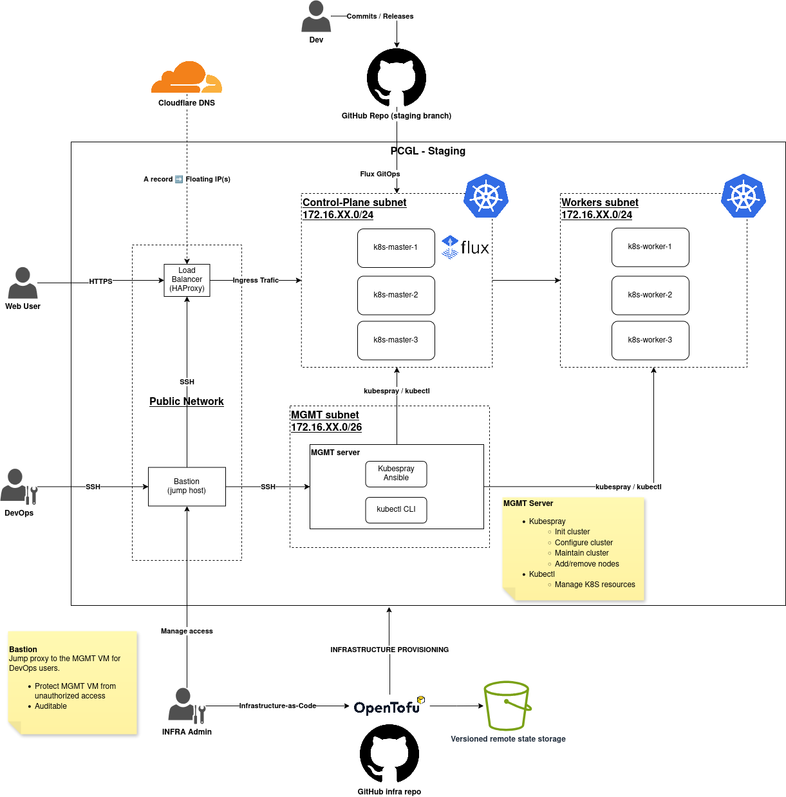

# Kubernetes provisioning template for OpenStack with OpenTofu



Use this repository as a template to provision the resources needed for a secure high-availability K8S cluster:
- Bastion VM
  - **Only instance to allow SSH from outside**
  - See [The Bastion](https://ovh.github.io/the-bastion/using/basics/first_steps.html) usage docs
  - The opentofu module outputs the Bastion alias for the bootstrapped user
  - Jump proxy SSH connections to:
    - Management VM
    - Load Balancer
  - FLoating IP with a Cloudflare DNS record
  - On the `mgmt-net` network
- Management VM
  - Contains the tools to bootstrap and manage the K8S cluster
  - On the `mgmt-net` network
  - SSH access via Bastion **only**
- Load Balancer VMs
  - Provision an HAProxy VM preconfigured for k8s endpoints on the control-plane
  - HAProxy config for K8S endpoints is auto generated and enabled with Cloud-Init
  - On the `lb-net` network
    - Security group for TCP ingress on port `6443` only
  - SSH access via Bastion **only**
- Control plane VMs
  - Provision the desired number of VMs for the K8S control plane
  - On the `cp-net` network
    - Allow 6443 TCP ingress from load-balancer security-group
    - Allows mgmt and worker security-group trafic
    - SSH via mgmt only (Kubespray)
- Worker VMs
  - Provision the desired number of VMs as K8S worker nodes
  - On the `worker-net` network
    - Allows mgmt and control plane security-group trafic
    - SSH via mgmt only (Kubespray)


## Requirements
Make sure you meet the requirements before using this repository:
-   An OpenStack RC file you can source in your terminal
-   Adequate OpenStack quotas for the resources you plan on creating
-   [OpenTofu CLI](https://opentofu.org/docs/intro/install/)
-   An S3 bucket in your OpenStack project reserved for OpenTofu (e.g. "fried_tofu")
-   S3 credentials valid for the bucket
-   Openstack CLI to get UUIDs and resource names
-   (Recommended) [jq](https://jqlang.org/) to parse JSON variables from OpenStack CLI
-   (Recommended) aws CLI for advanced S3 operations
    -   Why? The aws CLI has the best interfaces to manage versionned buckets

### What/Why OpenTofu?
[OpenTofu](https://opentofu.org/) is a drop-in replacement for Terraform, it enables reliable and 
flexible infrastructure as code on a number of providers, including OpenStack.

Contrary to other Terraform compatible alternatives like Pulumi, OpenTofu is fully free, open-source and under the wing 
of the Linux Foundation, ensuring we won't need to spin on a dime if/when Terraform changes its license for the worst.

### Storage backend configuration

Read more on the OpenTofu [Backend config page](https://opentofu.org/docs/language/settings/backends/configuration/).
This repo implements the [Remote State](https://opentofu.org/docs/language/state/remote/) backend using SD4H's S3 API.

This state management strategy is more robust, especially when working in teams:
> With remote state, OpenTofu writes the state data to a remote data store, which can then be shared between all members
>  of a team. OpenTofu supports storing state in TACOS (TF Automation and Collaboration Software), HashiCorp Consul, 
> Amazon S3, Azure Blob Storage, Google Cloud Storage, Alibaba Cloud OSS, and more.

For usage on SD4H, the most convenient path is to use the provided S3 API!
> [!IMPORTANT]
> Before applying this module, make sure you have the following ready:
1. Your OpenStack project has a private bucket dedicated to OpenTofu, **with bucket versioning enabled**
   1. Bucket versioning must be enabled with the S3 API, Swift will not work. (instructions bellow)
2. You have S3 credentials on that project
   1. Find existing credentials with `openstack ec2 credentials list`, pay attention to the project ID
   2. If you don't already have credentials for that project, generate them with `openstack ec2 credentials create`

If you don't have the above, here is how to set it up quickly:

```bash
# Source the OpenStack RC file for your project
source my-project-openrc.sh

# Create S3 credentials for your user in the current project
openstack ec2 credentials create

# Create a local profile for your aws CLI for S3 operations on SD4H (change my-profile to the OpenStack project name)
# This is needed to setup bucket versioning
aws configure --profile=my-profile
> AWS Access Key ID [None]: <COPY FROM ABOVE>
> AWS Secret Access Key [None]: <COPY FROM ABOVE>
> Default region name [None]: <LEAVE EMPTY>
> Default output format [None]: json  

# For convenience, make an alias that includes the SD4H object store endpoint
# Use an alias name that clearly identifies the OpenStack project name
alias aws-sd4h-my-profile="aws --profile my-profile --endpoint-url=https://objets.juno.calculquebec.ca"

# Create a regular bucket for storage backend
aws-sd4h-my-profile s3 mb s3://fried_tofu

# Enable bucket versioning on the created bucket
aws-sd4h-my-profile s3api put-bucket-versioning \
  --bucket fried_tofu \
  --versioning-configuration Status=Enabled

# Verify versioning is enabled
aws-sd4h-my-profile s3api get-bucket-versioning --bucket fried_tofu
# Good to go if you get this in the response: { "Status" : "Enabled"}
```

Now, every time `tofu apply` is used, a new state version will be automatically uploaded to the S3 bucket we configured.


This allows us to retrieve a previous state if needed. To get the list of state object versions:

```bash
aws-sd4h-my-profile s3api list-object-versions --bucket fried_tofu --prefix <cluster_name variable value>
```

### Cloud-Init templates

The VM provisioning relies on Cloud-Init for all nodes, ready to use templates can be found at `userdata/tpl/*.yaml`.

> [!WARNING]
> Files under `userdata/live/` are ignored by Git by default, in order to avoid leaking sensitive data to source control.


Create the files you will be using from the templates:
```bash
mkdir -p userdata/live
cp userdata/tpl/* userdata/live

# Edit the files to include your SSH keys             (REQUIRED)
# Edit the files to include extra packages you need   (OPTIONAL)
# Edit the files to include extra users               (OPTIONAL)
```

### Configuration variables

The `terraform.tfvars` file is auto discovered by OpenTofu when running `plan` and `apply`, 
use it to provide the values to the required variables.


You can create one from the provided template:
```bash
cp terraform.tfvars.example terraform.tfvars
```

Set appropriate values for all variables.
> [!WARNING]
> Note that this config file uses a cloudlare API token, so it should never be commited to source control.
>
> By default, `terraform.tfvars` is in the gitignore, **DO NOT CHANGE THIS**.

```bash
# Cluster name, will be the prefix to all OpenStack resources created.
# Use a lower case hyphen-separated name for consistency
cluster_name = "c3g-dev-k8s"

cloudflare_api_token = "<YOUR CLOUDFLARE API TOKEN>"

# Image variables, always use the ID.
#   Get options with 'openstack image list'
bastion_image       = "IMAGE UUID"
mgmt_image          = "IMAGE UUID"
control_plane_image = "IMAGE UUID"
worker_image        = "IMAGE UUID"

# Flavor variables, always use the ID.
#   Get options with 'openstack flavor list'
bastion_flavor       = "FLAVOR UUID"
mgmt_flavor          = "FLAVOR UUID"
control_plane_flavor = "FLAVOR UUID"
worker_flavor        = "FLAVOR UUID"

# Volume sizes in GB.
bastion_volume_size       = 20
mgmt_volume_size          = 20
control_plane_volume_size = 50
worker_volume_size        = 50

# Volume types: volumes-ssd OR volumes-ec
bastion_volume_type       = "volumes-ssd"
mgmt_volume_type          = "volumes-ssd"
control_plane_volume_type = "volumes-ssd"
worker_volume_type        = "volumes-ssd"

# Instance counts
control_plane_count = 3 # Default (3 or more for HA)
worker_count        = 3 # Default (3 or more for HA)

# Cloud-Init (User data)
bastion_user_data_path = "userdata/live/bastion.yaml"  # Make sure to add your public SSH key in the Bastion cloud-init !!!
mgmt_user_data_path    = "userdata/live/mgmt.yaml"
cp_user_data_path      = "userdata/live/k8s-master.yaml"
worker_user_data_path  = "userdata/live/k8s-worker.yaml"
lb_user_data_path      = "userdata/live/load-balancer.yaml"

# OpenStack keypair
#   Get valid options with 'openstack keypair list'
keypair = "YOUR KEYPAIR NAME"

# Networking
public_network_id = "PUBLIC NETWORK UUID"
router_name       = "ROUTER NAME"

# Bastion config
bastion_admin_user_name    = "<USERNAME FOR THE INITIAL BASTION ADMIN>"
bastion_admin_user_pub_key = "<PUBLIC SSH KEY FOR THE USER>"
bastion_name               = "<BASTION NAME>" # Will also be the Bastion alias name
```

## Usage

With the S3 storage backend in place, using this template is as simple as this:

```bash
# clone or fork this repo, then cd to it

# Source the OpenStack RC file.
# Make sure to use the file for the appropriate OpenStack project!!!
source my-project-openrc.sh

# Load the S3 credentials in env variables for security
# The following commands extract the ACCESS_KEY and SECRET from the first credential found in the current project
export AWS_ACCESS_KEY_ID=$(\
  openstack ec2 credential list --format json | \
  jq -r '[.[] | select(."Project ID"==$ENV.OS_PROJECT_ID)] | .[0].Access'
)
export AWS_SECRET_ACCESS_KEY=$(\
  openstack ec2 credential list --format json | \
  jq -r '[.[] | select(."Project ID"==$ENV.OS_PROJECT_ID)] | .[0].Secret'
)

# (Optional but recommended)
# Prepare the variables for the OpenTofu module
# If you don't do this, OpenTofu will give you interactive prompts to provide values.
cp terraform.tfvars.example terraform.tfvars

# Modify the variables according to your needs (see previous section)
vim terraform.tfvars

# Init the OpenTofu directory
tofu init

# Plan the OpenTofu deployment
tofu plan

# Review the plan and fix what needs fixing, then plan again
# Repeat until no errors in plan

# Apply your deployment plan!
tofu apply
```

Assuming that apply went well, you now have all your VMs, networks, security groups and floating IPs ready for the K8S bootstrap!

It also creates a DNS record for the Bastion VM: `bastion.<CLUSTER NAME>.sd4h.ca`

## Bastion config

After a succesful `tofu apply`, the module will output the Bastion alias for your admin user.
You will need to wait a few minutes for the Cloud-Init to be fully applied before attempting to SSH.

Once the Clout-Init has been applied, you should be able to SSH using the alias output.
If the Bastion DNS record is not propagated yet, using the IP instead of the domain also works.

### Create Bastion group

```bash
# Create a group
<BASTION ALIAS> --osh groupCreate --group k8s --owner <BASTION ADMIN USER NAME> --algo ed25519
# Copy the group's public key
```

### Prepare VMs to be accessible via Bastion

To make VMs accessible via the Bastion group we created, we need to add the group's public SSH key to the VMs' user data.

Do the following in:
  - `userdata/live/mgmt.yaml`
  - `userdata/live/load-balancer.yaml` (optional, can be done later)

```yaml
#cloud-config
users:
  # ... don't touch the other users, just update the 'bastion' user
  - name: bastion
    groups: adm, wheel, systemd-journal
    selinux_user: unconfined_u
    sudo: ALL=(ALL) NOPASSWD:ALL
    ssh_authorized_keys: [
      # ADD BASTION GROUP'S EGRESS KEY HERE!!!
      <YOUR-BASTION-GROUP-EGRESS-KEY>,
    ]
```

Changing Cloud-Init files will result in VMs being fully replaced, so only do this once.

Review the plan and apply it if it looks good:

```bash
# Review plan
tofu plan

# Apply the changes
tofu apply
```

Wait for Cloud-Init to finish, otherwise the new authorized SSH key will not be ready.

### Add our VMs to the Bastion group

Now we can add the VMs to the list of servers belonging to the Bastion group.
Use the `groupAddServer` Bastion command to add the management server to the group.
```bash
# For the mgmt VM
<BASTION ALIAS> --osh groupAddServer --group k8s --host <CLUSTER NAME>-mgmt --user bastion --port 22

# For the Load Balancer (optional)
<BASTION ALIAS> --osh groupAddServer --group k8s --host <LB PRIVATE IP> --user bastion --port 22 --comment "load balancer"

# Test access!
# e.g. bssh bastion@c3g-dev-k8s-mgmt
<BASTION ALIAS> bastion@<CLUSTER NAME>-mgmt
```

At this point, the users in the group can connect to the management VM via bastion, and bootstrap the K8S cluster!
K8S managers will need to have Bastion accounts, they can jump to the management VM by using the Bastion SSH alias:
```bash
# Users need to setup their Bastion alias in their .bash_aliases
alias bssh-<CLUSTER NAME>='ssh <USERNAME>@bastion.<CLUSTER NAME>.sd4h.ca -t -- '

# SSH to the mgmt VM via Bastion!
<BASTION ALIAS> bastion@<CLUSTER NAME>-mgmt
```

## Kubernetes bootstrap

Everything should now be ready to begin bootstraping your HA Kubernetes cluster!
- An HAProxy load balancer is serving the K8S endpoints
- Networks and security groups isolate the

We recommend and document two popular options: [Kubespray](https://kubespray.io) and [Talos Linux](https://www.talos.dev/v1.10/)

### Kubespray
COMING SOON

### Talos and talosctl

Refer to the official Talos Linux instructions for cluster configuration on Openstack, [here](https://www.talos.dev/v1.10/talos-guides/install/cloud-platforms/openstack/#cluster-configuration).

The steps before "Cluster Configuration" have been taken care of by the OpenTofu module, start from there until you have a working kubeconfig.

#### Generate Clout-Init files for Talos
```bssh
# SSH to the management VM
<BASTION ALIAS> bastion@<CLUSTER NAME>-mgmt

# Install talosctl
curl -sL https://talos.dev/install | sh

# Generate the talosconfig
talosctl gen config <CLUSTER NAME> https://${LB_PUBLIC_IP}:6443

# Copy the content of 'controlplane.yaml'
# Copy the content of 'worker.yaml'
```

#### Provision Talos control-plane and workers
Paste the content of 'controlplane.yaml' into `userdata/live/k8s-master.yaml`.
Paste the content of 'worker.yaml' into `userdata/live/k8s-worker.yaml`.

> [!CAUTION]
> Talos Cloud-Init files contain sensitive information.
> Never commit this file, it can be retrieved by authorized Bastion users when needed.

This will cause a replacement of all control-plane and worker nodes, with the required Talos user data for bootstrap.

Plan and apply the changes:
```bash
tofu plan   # make sure planned changes look OK
tofu apply  # apply the changes
```

#### Bootstrap Talos

Once the control-plane and worker VMs are up and running, we can bootstrap the Talos cluster.
Take note of the private IP for one of the control-plane VMs (doesn't matter which one!).

```bash
# SSH to the management VM
<BASTION ALIAS> bastion@<CLUSTER NAME>-mgmt

# Configure Talos bootstrap endpoint
talosctl --talosconfig talosconfig config endpoint <control plane 1 IP>
talosctl --talosconfig talosconfig config node <control plane 1 IP>

# Bootstrap the cluster!
talosctl --talosconfig talosconfig bootstrap

# Get the kubeconfig file and place it at the expected location for kubectl
talosctl --talosconfig talosconfig kubeconfig .
mkdir -p ~/.kube
cp kubeconfig ~/.kube/config

# Start using the cluster!
kubectl get nodes     # All nodes should be in status "Ready"
kubectl get pods -A   # All pods in kube-system namespace should be running
```


## Cleaning up

At any time, the provisioned infrastructure can be quickly destroyed and recreated with a few `tofu` commands:

```bash
# Destroy
tofu destroy

# Recreate
tofu plan
tofu apply
```
